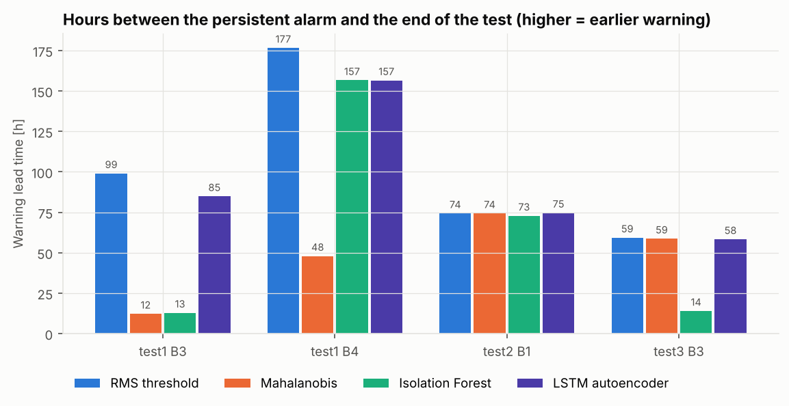
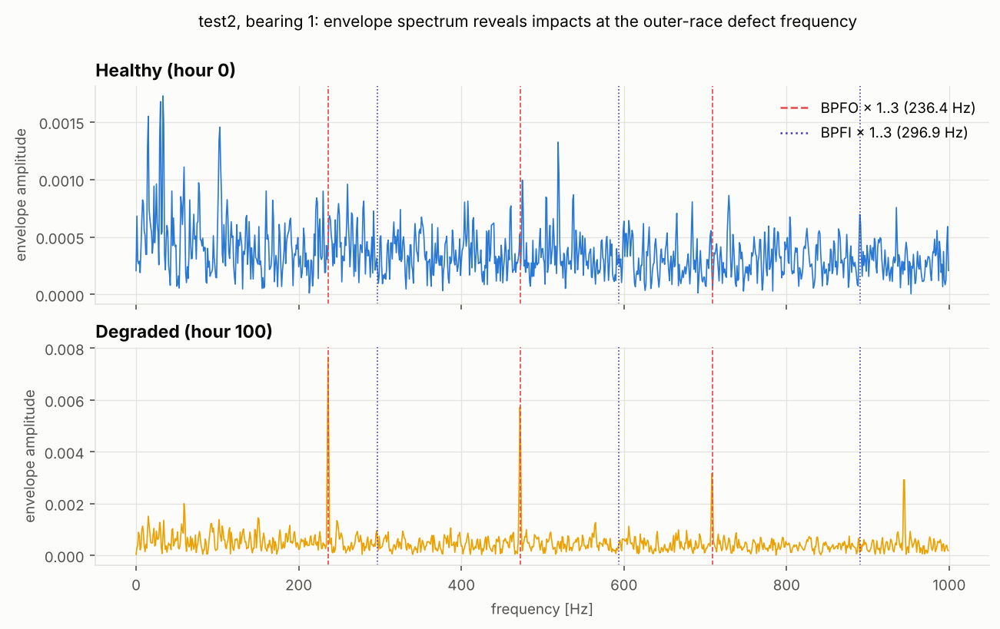

# Bearing Early Fault Warning

**An unsupervised system that warns days before a rolling-element bearing fails, evaluated on the
NASA / IMS run-to-failure dataset.**

Machines run for weeks while their bearings slowly wear out, and failure labels almost never exist
in practice. This system learns what *healthy* vibration looks like from the first part of each
bearing's life. When a bearing drifts away from that baseline, it raises a debounced alarm and names
the likely defect (outer race, inner race or rolling element).

> 📊 **Live dashboard:** [ecemaydemir.github.io/bearing_early_fault_warning](https://ecemaydemir.github.io/bearing_early_fault_warning/)
>
> 📄 **Technical report:** [English](report/report_en.pdf) · [Türkçe](report/report_tr.pdf)


## Results at a glance

On test2, every detector warns **about 74 hours before failure**, which is 45 % of the bearing's
life. The envelope-spectrum diagnosis correctly points at the **outer race**.

| Detector | test1 B3 (inner race) | test1 B4 (roller) | test2 B1 (outer race) | test3 B3 (outer race) | False alarms / 1000 bearing-h |
|:--|--:|--:|--:|--:|--:|
| RMS threshold (baseline) | 99 h | 177 h | 74 h | 59 h | 5.3 |
| Mahalanobis distance | 12 h | 48 h | 74 h | 59 h | 0.7 |
| Isolation Forest | 13 h | 157 h | 73 h | 14 h | **0.0** |
| LSTM autoencoder | 85 h | 157 h | **75 h** | 58 h | 12.7 |

Each value is the number of hours between the start of the alarm that persists until the end of the
test and the actual end of the test. Settings were tuned on test2 only. test1 and test3 are held out
and were never used for tuning.



## How it works

```
raw vibration (20 kHz)  ──►  18 condition indicators  ──►  anomaly score  ──►  k-of-n alarm  ──►  diagnosis
   9 464 snapshots            per channel                   4 detectors        4 of last 6       BPFO / BPFI / BSF
```

1. **Signal processing.** Each 1-second snapshot is reduced to the following indicators:
   * time-domain statistics (RMS, kurtosis, crest factor and others);
   * band energies;
   * **envelope-spectrum energy at the bearing's defect frequencies**, obtained with a 2–8 kHz
     band-pass filter and Hilbert demodulation.
2. **Per-bearing baseline.** Each bearing is compared only against its own healthy period.
3. **Four detectors** are trained on healthy data only: an RMS threshold, Mahalanobis distance,
   Isolation Forest and a denoising LSTM autoencoder.
4. **Alarm logic.** An alarm needs 4 of the last 6 snapshots above a threshold that was calibrated
   on healthy data, which suppresses single spikes.
5. **Diagnosis.** The defect frequency whose envelope energy rose the most names the failure mode.



Code excerpts: [`code_samples/features.py`](code_samples/features.py) (signal features) and
[`code_samples/alarm.py`](code_samples/alarm.py) (alarm logic).

## Interactive dashboard

The [live dashboard](https://ecemaydemir.github.io/bearing_early_fault_warning/) replays each test as if it
were streaming from the machine. It shows:

* each bearing's status and score against its threshold;
* which bearing alarmed first;
* the most likely defect.


## Tech stack

* Python, NumPy, SciPy, pandas
* scikit-learn, PyTorch
* Streamlit, Plotly, Matplotlib
* pytest, LaTeX

## Key lessons

* A plain RMS threshold is a strong baseline. A deep model is not automatically better on a dataset
  this small.
* Earlier warning comes at the cost of more false alarms.
* Restarts and regime changes (test3) are the main open problem for deployment. Re-baselining after
  maintenance is the next step.

## Dataset

[IMS Bearing Data](https://www.nasa.gov/intelligent-systems-division/discovery-and-systems-health/pcoe/pcoe-data-set-repository/),
NSF I/UCR Center for Intelligent Maintenance Systems, University of Cincinnati, distributed by the
NASA Prognostics Center of Excellence.

---

Ecem Aydemir
