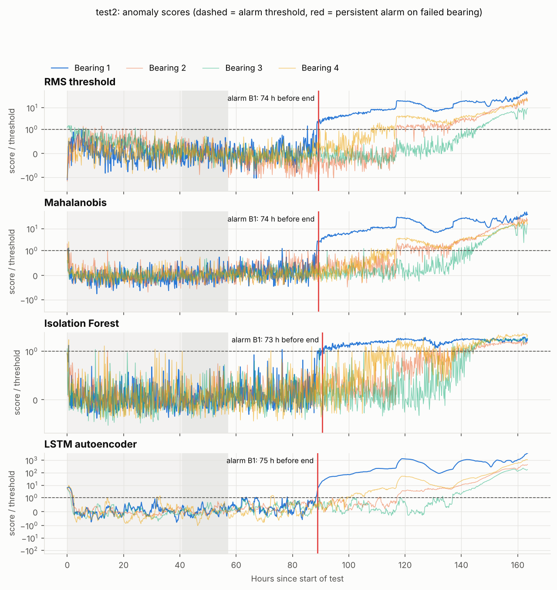
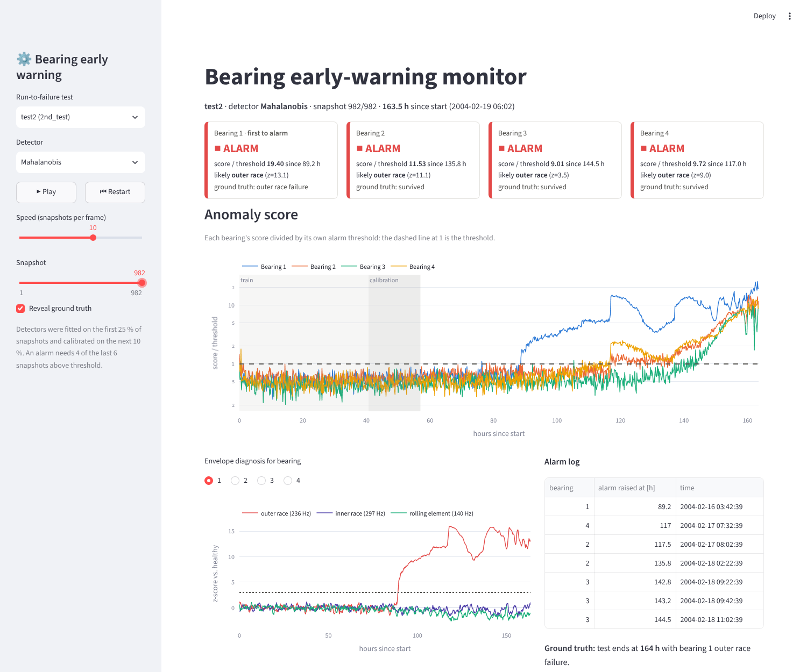
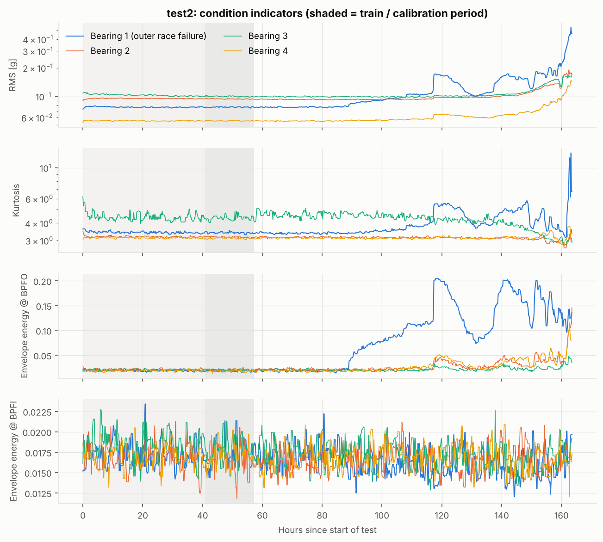

# Bearing Early Fault Warning

**Unsupervised early-warning system for rolling-element bearings, evaluated on the NASA / IMS run-to-failure dataset.**

A rotating machine runs for days or weeks while its bearings slowly wear out. Failure labels
almost never exist in practice. This project learns what *healthy* vibration looks like from the
first part of each test, then raises a debounced alarm when a bearing drifts away from it, and
names the most likely defect (outer race, inner race or rolling element) from the envelope spectrum.



## Results

Every detector is fitted only on the first 25 % of each test's snapshots. The alarm threshold
comes from the next 10 %. Nothing ever sees a failure label. `test2` was used to choose
settings; `test1` and `test3` are held out.

**Lead time** is the number of hours between the start of the alarm that persists until the end of
the test and the end of the test. **False alarms** are alarm episodes raised on any bearing in the
window that is believed healthy (after calibration, before degradation is visible; see
`configs/default.yaml`).

| Detector | test1 B3 (inner race) | test1 B4 (roller) | test2 B1 (outer race) | test3 B3 (outer race) | False alarms / 1000 bearing-h |
|:--|--:|--:|--:|--:|--:|
| RMS threshold (baseline) | 99 h | 177 h | 74 h | 59 h | 5.3 |
| Mahalanobis distance | 12 h | 48 h | 74 h | 59 h | 0.7 |
| Isolation Forest | 13 h | 157 h | 73 h | 14 h | **0.0** |
| LSTM autoencoder | 85 h | 157 h | **75 h** | 58 h | 12.7 |

Test durations: test1 828 h, test2 164 h, test3 1073 h.


**What this shows**

* On test2 every detector warns **about 74 hours (45 % of the bearing's life) before the end**,
  and the envelope-spectrum diagnosis points at the **outer race**, the actual failure mode.
* Lead time and false alarms trade off against each other. The RMS baseline and the LSTM
  autoencoder warn earliest on test1 but raise the most nuisance alarms. Isolation Forest raised
  none but warns late on test1 B3 and test3. Mahalanobis distance sits in between.
* A plain RMS threshold is a strong baseline. A deep model is not automatically better on a
  dataset this small; the LSTM autoencoder only matches it on lead time and has more false alarms.
* **test3 is hard**: after a stop around hour 360 every bearing's baseline shifts, so detectors
  trained before it treat the new normal as anomalous, and the real defect only appears in the
  last ~60 h. Re-baselining after restarts or maintenance is the main open item for deployment.
* The envelope diagnosis recognises the outer-race faults (test2; test3 with Isolation Forest)
  but not test1's inner-race and roller defects, where the signature is masked by noise.

Full per-bearing results: [`reports/summary.csv`](reports/summary.csv). Score traces:
`reports/scores.csv.gz`.

## Technical report

A detailed write-up of the whole project (theory, dataset, tools, methodology with code excerpts,
every figure with its interpretation, results, limitations) is available in two languages:

* English: [`report/report_en.pdf`](report/report_en.pdf)
* Türkçe: [`report/report_tr.pdf`](report/report_tr.pdf)

The LaTeX sources are in `report/`; rebuild them with `make report`.

## Interactive dashboard

`make dashboard` (or `streamlit run app/dashboard.py`) replays any test as if it were streaming
from the machine. Pick a test and a detector, press **Play**, and watch each bearing's status move
from healthy to alarm. Each tile shows the score against its threshold, how long the alarm has been
active, which bearing alarmed first (the likely source, since vibration travels to its neighbours)
and the defect frequency with the strongest envelope signature. Ground truth stays hidden until you
reveal it.



## How it works

```
raw 1-s snapshots (20 kHz)  ──►  18 condition indicators / channel  ──►  anomaly score  ──►  k-of-n alarm  ──►  diagnosis
   9 464 files, 6 GB              3 MB of CSV (committed)                 4 detectors          4 of last 6       BPFO / BPFI / BSF
```

1. **Features** (`src/bearing_efw/features.py`). Each snapshot becomes RMS, peak, peak-to-peak,
   kurtosis, skewness, crest, shape and impulse factors; relative energy in six frequency bands;
   spectral centroid; and **envelope-spectrum energy at the bearing defect frequencies**. The
   envelope is computed by band-passing 2-8 kHz, demodulating with the Hilbert transform and
   summing energy around 1-3× BPFO (236 Hz), BPFI (297 Hz) and BSF (140 Hz) for the Rexnord
   ZA-2115 bearing at 2000 rpm.
2. **Baseline per bearing** (`preprocess.py`). Features are log-transformed and standardized
   against the bearing's *own* healthy period, so one detector can serve bearings with different
   vibration levels.
3. **Detectors** (`models.py`), all fitted on healthy data only:
   * *RMS threshold*: the classic condition-monitoring rule, as a baseline
   * *Mahalanobis distance* with a Ledoit-Wolf shrinkage covariance
   * *Isolation Forest*
   * *LSTM autoencoder* over windows of 12 consecutive snapshots (~2 h), trained as a denoising
     autoencoder; its score only uses past data, so it can run online.
4. **Alarm logic** (`alarm.py`). The threshold is a high quantile of calibration scores plus a
   margin. An alarm requires 4 of the last 6 snapshots above threshold, which suppresses single
   spikes.
5. **Diagnosis**. At alarm time, the defect frequency whose envelope energy has risen the most
   (in z-score against the healthy baseline) names the likely failure mode.

### Design decisions that matter

* **Train on the beginning, test on the rest, never the reverse.** All splits are in time
  order. Training on shuffled windows from the whole run (a common mistake with this dataset)
  leaks the failure into training and makes any model look good.
* **One snapshot = one point in time.** Features are computed per 1-second file rather than by
  concatenating all files into one long signal, so results are expressed in hours before failure.
* **The right bearing.** In test1 the bearings that fail are 3 and 4; in test2 bearing 1; in test3
  bearing 3. Each bearing is monitored separately.
* **Splits by snapshot count, not wall-clock time.** test1 was recorded in bursts with
  multi-day gaps; a time-based split would leave almost no training data.
* **Dead snapshots are dropped.** The last file of test2 and test3 is a near-zero signal recorded
  after shutdown.



## Dataset

[IMS Bearing Data](https://www.nasa.gov/intelligent-systems-division/discovery-and-systems-health/pcoe/pcoe-data-set-repository/)
from the NSF I/UCR Center for Intelligent Maintenance Systems, University of Cincinnati,
distributed by the NASA Prognostics Center of Excellence. Four bearings on one shaft at
2000 rpm under a 6000 lb radial load; three run-to-failure tests:

| Test | Snapshots | Channels | Failure at end of test |
|:--|--:|--:|:--|
| test1 | 2 156 | 8 (x and y per bearing) | Bearing 3 inner race, bearing 4 roller element |
| test2 | 984 | 4 | Bearing 1 outer race |
| test3 | 6 324 | 4 | Bearing 3 outer race |

The raw data (~1 GB download, ~6 GB extracted) is **not** in this repository. The extracted
feature tables in `data/features/` are, so every result can be reproduced without downloading it.

## Reproduce

```bash
pip install -r requirements.txt

make experiment   # ~2 min on a laptop CPU, uses the committed feature tables
make dashboard    # interactive replay at http://localhost:8501
make test

# Optional: rebuild the features from raw data
make data         # downloads + extracts to data/raw (needs `unar`: brew/apt install unar)
make features     # ~2 min with 4 processes
```

Walkthrough with plots and commentary: [`notebooks/01_walkthrough.ipynb`](notebooks/01_walkthrough.ipynb).

## Repository layout

```
configs/default.yaml        splits, thresholds, alarm rule, model hyper-parameters
src/bearing_efw/
    dataset.py              test metadata, bearing geometry, defect frequencies, file loader
    features.py             time, spectral and envelope features per snapshot
    preprocess.py           per-bearing matrices, log + standardization, train/calibration masks
    models.py               RMS, Mahalanobis, Isolation Forest, LSTM autoencoder
    alarm.py                thresholding, k-of-n debouncing, alarm episodes
    plots.py                report figures
scripts/                    download_data.py, build_features.py, run_experiment.py, make_report_figures.py
app/dashboard.py            Streamlit replay of a test with live status, diagnosis and alarm log
data/features/              extracted features (committed)
reports/                    results.md, summary.csv, scores.csv.gz, figures/
notebooks/                  01_walkthrough.ipynb
report/                     technical report, LaTeX sources + PDFs (English and Turkish)
tests/                      unit tests (features, synthetic outer-race fault, alarm logic, dashboard smoke tests)
```

## Limitations and next steps

* Ground truth is only "failed at the end of the test", so lead time measures how early an alarm
  persists, not detection of a known onset. The "healthy" window used for false alarms is a judgement
  call documented in the config.
* Three tests is a small sample; numbers will move with different settings. They were chosen on
  test2 only.
* Next: re-baselining after restarts (test3) and remaining-useful-life estimation after the alarm.

## References

* H. Qiu, J. Lee, J. Lin, G. Yu. *Wavelet filter-based weak signature detection method and its
  application on rolling element bearing prognostics.* Journal of Sound and Vibration 289 (2006).
* J. Lee, H. Qiu, G. Yu, J. Lin. *Bearing Data Set*, IMS, University of Cincinnati. NASA Prognostics
  Data Repository (2007).
* R. B. Randall, J. Antoni. *Rolling element bearing diagnostics: A tutorial.* Mechanical Systems and
  Signal Processing 25 (2011).

---

Ecem Aydemir
